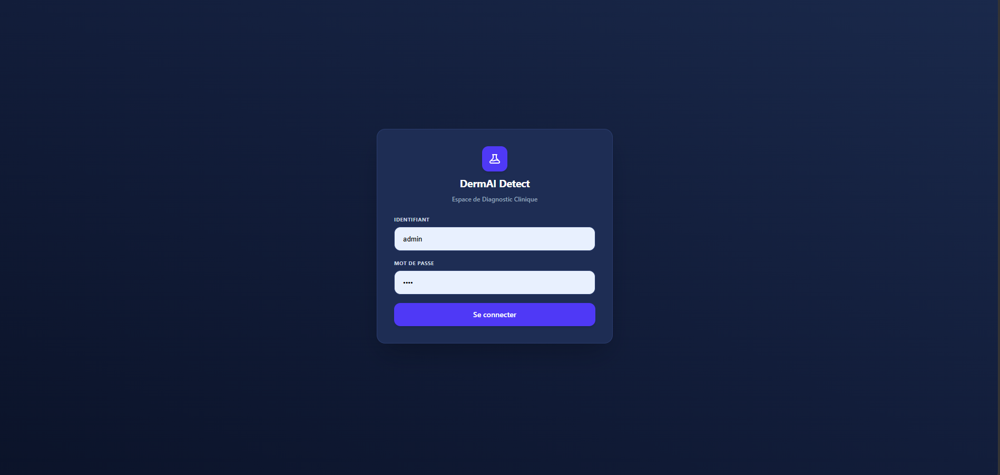
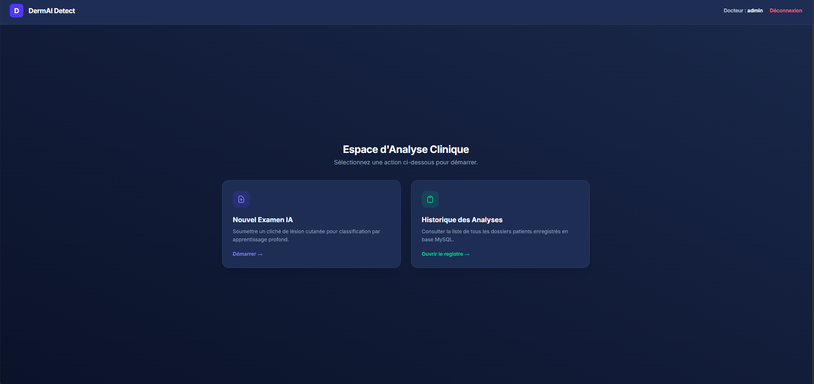
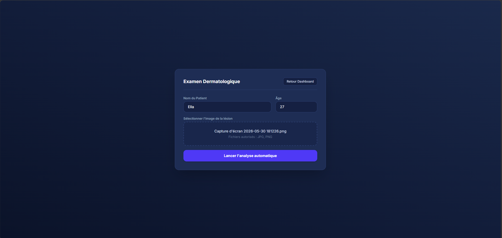
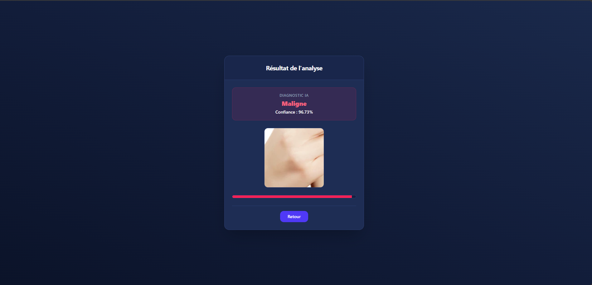
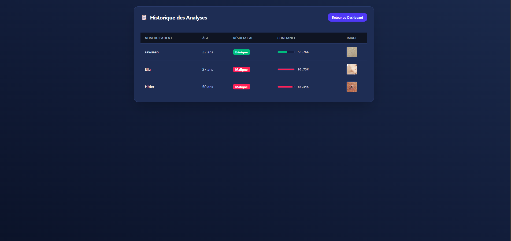

# Application Clinique de Détection et Diagnostic des Lésions Cutanées par Intelligence Artificielle

Ce projet présente une application médicale web complète conçue pour assister le personnel clinique dans l'analyse et la classification automatisée des lésions de la peau. L'objectif principal est de fournir un outil d'aide au diagnostic rapide, précis et sécurisé permettant de différencier les cas de tumeurs bénignes des cas malins.

L'application intègre un modèle de deep learning basé sur l'architecture VGG16, entraîné spécifiquement sur des données dermatologiques pour fournir une estimation fiable accompagnée d'un score de confiance. L'interface utilisateur applique les standards modernes du web médical avec un environnement sécurisé et une navigation fluide.

## Architecture Technique et Technologies

### Environnement Backend
Python et le framework Flask pour la gestion du serveur, le routage des requêtes et l'exécution de la logique métier. TensorFlow et Keras gèrent le chargement de l'architecture neuronale et le traitement des prédictions en temps réel. Une base de données locale assure l'archivage et le suivi rigoureux des dossiers des patients.

### Interface Frontend
L'interface utilise HTML5 structuré pour une accessibilité optimale des données médicales. L'habillage graphique s'appuie sur Tailwind CSS pour l'application d'un thème sombre moderne "Medical Navy & Purple" assurant un confort visuel lors d'une utilisation clinique prolongée. JavaScript gère la dynamisation de l'interface, le contrôle des chargements et l'affichage fluide des jauges de confiance.

## Fonctionnalités Principales de l'Application

Système d'Authentification Clinique : Un portail de connexion restrictif garantissant que seul le personnel médical autorisé peut accéder aux données et soumettre des analyses.

Tableau de Bord Centralisé : Une interface d'accueil épurée agissant comme hub principal pour diriger le médecin vers les différents modules de l'application.

Analyse IA et Prédiction Instantanée : Un module d'importation d'images médicales permettant au praticien de soumettre une photo de lésion cutanée et d'obtenir un diagnostic immédiat avec calcul du pourcentage de certitude.

Registre Historique Global : Un système de traçabilité complet stockant l'ensemble des dossiers des patients, leurs fiches de renseignements et les conclusions des analyses passées.

---

## Guide Visuel et Captures d'Écran du Projet

### 1. Page de Connexion (Login)
L'interface d'authentification sécurisée requise pour l'accès à l'espace de travail médical. Elle protège la confidentialité des données des patients.

### 2. Tableau de Bord (Dashboard)
Le point d'ancrage de l'utilisateur après une connexion réussie. Cette interface centralise la navigation et affiche les raccourcis vers les actions clés du parcours de soin.

### 3. Page de Diagnostic (Upload)
L'espace de travail dédié au dépôt des photographies cliniques des lésions cutanées. Le système prépare l'image pour sa transmission au modèle d'intelligence artificielle.

### 4. Résultat du Diagnostic (Analyse)
La vue finale affichant le verdict de la classification (Bénigne ou Maligne). Elle intègre une représentation graphique claire sous forme de jauge pour matérialiser le score de confiance calculé par le réseau de neurones.

### 5. Registre de l'Historique des Analyses
Le tableau de suivi médical qui récapitule l'historique complet des consultations. Il permet au médecin de consulter, trier et suivre l'évolution des dossiers des patients enregistrés.

